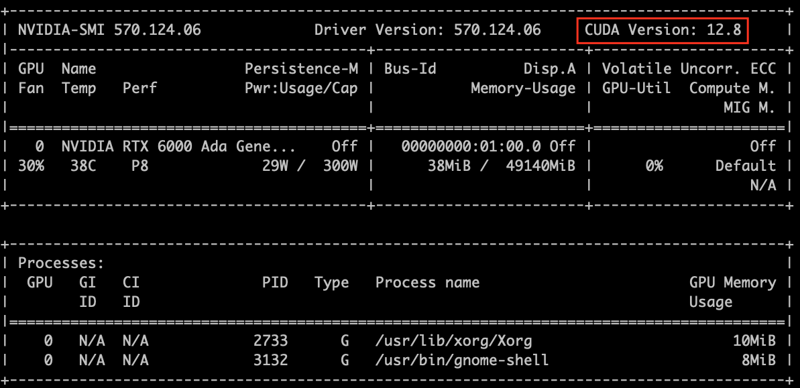

# LLM Demo Overview
This is a quiz-style game between two LLM agents. For each user question typed at the keyboard for the judge, both agents answer in parallel. The Judge announces whichever answer arrives first (or a timeout if neither responds within 5 sec), and prints per-question elapsed physical time. 
# Directory Structure
- [federated](src/federated/) - Directory for federated versions of LLM demos.
# Pre-requisites 
You need Python >= 3.10 installed.
## Library Dependencies
To run this project, there are dependencies required which are in [requirements.txt](requirements.txt) file. The model used in this repository has been quantized using 4-bit precision (bnb_4bit) and relies on bitsandbytes for efficient matrix operations and memory optimization. So specific versions of bitsandbytes, torch, and torchvision are mandatory for compatibility. 
While newer versions of other dependencies may work, the specific versions listed below have been tested and are recommended for optimal performance.
It is highly recommended to create a Python virtual environment or a Conda environment to manage dependencies. \
To create the a virtual environment follow the steps below.
### Step 1: Creating environment
```
python3 -m venv llm
source llm/bin/activate 
```
For activating the environment everytime use "source llm/bin/activate". \
Or
```
conda create -n llm
conda activate llm
```
### Step 2: Installing the required packages
Check if pip is installed:
```
pip --version
```
If it is not installed:
```
python -m pip install --upgrade pip
```
Run this command to install the packages from the [requirements.txt](requirements.txt) file:\
**Note**: Since we are using LLMs with 7B and 70B parameters it is recommended to have a device with GPU support. 
```
pip install -r requirements.txt
```
To check if all the requirements are installed, run:
```
pip list | grep -E "transformers|accelerate|tokenizers|bitsandbytes"
```
For installing torch:

1. For devices without GPU
```
pip install torch torchvision
```
2. For devices with GPU
   Checking the CUDA version run this command:
```
nvidia-smi
```
   Look for the line "CUDA Version" as shown in the image: \
    

   With the correct version install PyTorch from [PyTorch](https://pytorch.org/get-started/locally/) by selecting the right correct OS and compute platform as shown in the image below for Linux system with CUDA version 12.8: \
    
### Step 3: Model Dependencies  
**Pre-trained Models used in the program**:  [meta-llama/Llama-2-7b-chat-hf](https://huggingface.co/meta-llama/Llama-2-7b-chat-hf) , [meta-llama/Llama-2-70b-chat-hf](https://huggingface.co/meta-llama/Llama-2-70b-chat-hf) \
**Note:** Follow the steps below to obtain the access and authentication key for the hugging face models.
1. Create the user access token and follow the steps shown on the official documentation: [User access tokens](https://huggingface.co/docs/hub/en/security-tokens)
2. Log in using the Hugging Face CLI by running huggingface-cli login. Please refer to the official documentation for step-by-step instructions - [HuggingFace CLI](https://huggingface.co/docs/huggingface_hub/en/guides/cli)
3. For the Llama Models you will require access to use the models if you are using it for the first time. Open these links and apply for accessing the models ([meta-llama/Llama-2-7b-chat-hf](https://huggingface.co/meta-llama/Llama-2-7b-chat-hf), [meta-llama/Llama-2-70b-chat-hf](https://huggingface.co/meta-llama/Llama-2-70b-chat-hf))
## System Requirements  
To ensure optimal performance, the following hardware and software requirements are utilized. \
**Note:** To replicate this demo, you can use any equivalent hardware that meets the computational requirements.
### Hardware Requirements   
The demo was tested with the following hardware setup.
- **GPU**: NVIDIA RTX A6000, NVIDIA RTX PRO 6000 Blackwell
### Software Requirements  
The demo was tested with the following software requirements.
- **OS**: Linux
- **Python**: 3.12.3 and 3.12.4   
- **CUDA Version**: 12.8 and 13.0
- **Lingua Franca**: 0.10.1 and 0.11.1 

Make sure the environment is properly configured to use CUDA for optimal GPU acceleration.
# Files and directories in this repository
  - **`llm_base_class.lf`** - Contains the base reactors LlmA, LlmB, and Judge.
  - **`llm_quiz_game.lf`** - Lingua Franca program that defines the quiz game reactors (LLM agent A, LLM agent B and Judge).
# Execution Workflow 
### Step 1: 
Run the **`llm_quiz_game.lf`**.  
**Note:** Ensure that you specify the correct file paths. \
Run the following commands:  
```
lfc src/llm_quiz_game.lf
```
### Step 2: Run the binary file and input the quiz question
Run the following commands:  

```
./bin/llm_quiz_game
```
The system will ask for entering the quiz question which is to be obtained from the keyboard input. \
Example output printed on the terminal:
<pre>
--------------------------------------------------
******* Using Python version: 3.12.3
[LlmA] Loading Llama-2-7B chat model
`torch_dtype` is deprecated! Use `dtype` instead!
Loading checkpoint shards: 100%|| 2/2 [00:10<00:00,  5.13s/it]
[LlmA] 7B model ready.
[LlmB] Loading Llama-2-70B chat model
Loading checkpoint shards: 100%|| 15/15 [01:39<00:00,  6.62s/it]
[LlmB] 70B model ready.
---- System clock resolution: 1 nsec
---- Start execution on Mon Dec 22 15:47:42 2025 ---- plus 210511558 nanoseconds
Enter the quiz question
What is the capital of South Korea?
Enter the quiz question

Query: What is the capital of South Korea?

waiting...

LLM-A inference time: 1667 ms | LLM-B inference time: 1523 ms
Winner: LLM-B | Chosen inference time 1523 ms | Judge physical time 1669 ms
Answer: Seoul.
--------------------------------------------------
</pre>
# Contributors
- Deeksha Prahlad (dprahlad@asu.edu), Ph.D. student at Arizona State University
- Hokeun Kim (hokeun@asu.edu, https://hokeun.github.io/), Assistant professor at Arizona State University 
